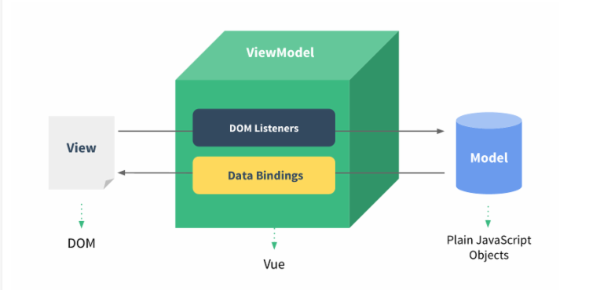

VUE课程

# 1.什么是vue

是一套前端框架，简化前端大量的jquery，原生js的重复DOM操作代码。用来简化开发。

是一套数据驱动视图的前端框架，基于MVVM架构，M：model数据，V：view视图，vm：viewModel视图数据监听器，当数据改变，修改视图；当视图发生变化，修改model数据。是一种数据双向绑定监听的实现。

是国人尤雨溪开发。



# 2.开发环境准备

1. hbuilderX前端开发工具
2. chrome浏览器调试程序

# 3.使用vue

1. 引入vue.js依赖

   cdn加速服务引入：文件存储在服务器上 通过外网访问 不需要本地存放。

   <script src="https://cdn.bootcdn.net/ajax/libs/vue/2.6.11/vue.min.js"></script>

   本地引入：

   - 开发版本：支持vue调试工具，开发使用

   - 正式版本：不支持vue调试工具，上线使用

     

2. 入门测试：

   ```javascript
   <!--vue绑定页面数据 需要一个根标签作为渲染的基板-->
   <div id="base">
       <!--插值表达式，获取data对象中的数据-->
       {{msg}}
   </div>
   
   <script>
       //原data数据对象 也可以在vue对象中直接定义
       let mydata = {msg:'尚马教育'}
       //创建Vue实例对象，每个vue应用都是从这里开始
       let vm = new Vue({
           //将基板与vue对象绑定 如果没有在基板中的数据 不会被vue渲染
           el:"#base",
           //页面上显示的数据对象   
           data:mydata
    })
   
       //取得vue实例对象中的数据,与原data对象中数据一致
       console.log(vm.msg)
       //设置vue实例对象中数据，原data对象也改变,同时页面显示数据发生改变
       vm.msg='郑州尚马教育'
       console.log(mydata.msg)
   	console.log(vm.msg)
       mydata.msg='武汉尚马教育'
   	console.log(mydata.msg)
       console.log(vm.msg)
   </script>
   ```
   
3. 注意点：

    只有当实例被创建时就已经存在于 `data` 中的 property 才是**响应式**的 ，后续向vue实例对象中添加的数据无效。<u>**建议页面中数据预先定义在vue实例对象中。**</u>

# 4.vue基本语法

1. 插值表达式

   数据绑定基本方式就是使用 {{ xxx }}（双大括号）的文本插值 可将modelView中的数据渲染到页面中对应的位置，页面中绑定的位置根据modelView中定义的数据改变而改变

2. vue对象中的属性

   vue对象中的属性 可以通过创建的vue对象读取到，但是如果读取vue对象的属性时 通常需要通过$指明 跟data中用户自定义属性有所区分

   ```javascript
   console.log(vm.$data)
   console.log(vm.$el)
   console.log(vm.$data.msg)
   //为了省略 如果对data中的数据进行取值时 可以省略$data
   //vm.$data.msg 等同于 vm.msg
   console.log(vm.msg)
   ```

3. v-html插入html代码

   因为vue中关注数据绑定 而不是页面中元素变化 插值默认不可以插入html代码  如果在一些特殊场景 需要插入html代码时 可以使用v-html指令

   ```javascript
   <div id="base">
       <div v-html="msg"></div>
   </div>
       
   <script>
   new Vue({
     el: '#base',
     data: {
       msg: '<h1>带格式的标题</h1>'
     }
   })
   </script>
   ```

4. v-bind指令将html中元素与viewModel中数据绑定 html的属性都可以通过v-bind与数据模板进行绑定

   ```javascript
   		<style>
   			.test{
   				background-color: lightcoral;
   				width: 100%;
   				height: 100%;
   			}
   		</style>	
   
   		<div id="base">
   			<div v-bind:class="mycls">
   				123
   			</div>
   		</div>
   
           <script>
               var myvue = new Vue({
                   el:"#base",
                   data:{
                       mycls:"test"
                   }
               })
           </script>
   ```

   同时因为class属性是允许多值的 比较特殊 所以在class属性的绑定上 还提供了额外的方式

   ```javascript
   		<style>
   			.cls1{
   				width: 100px;
   				height: 100px;
   			}
   			.cls2{
   				background-color: #F08080;
   			}
   			.cls3{
   				color: aliceblue;
   			}
   		</style>	
   
   		<div id="base">
               <!-- 一定有的class属性 可以单写class属性赋值（cls3） 
               需要动态控制的class属性 可以通过bol值决定是否生效 并且可以配置多个（cls1 cls2） -->
   			<div class="cls3" v-bind:class="{'cls1':cls1use,'cls2':cls2use}">
   				123
   			</div>
   		</div>
   		
           <script>
               var myvue = new Vue({
                   el:"#base",
                   data:{
                       cls1use:true,
                       cls2use:true
                   }
               })
           </script>
   ```

   ​	注意：v-bind指令比较常用 所有在使用v-bind指令时 通常可以简写为  :属性

   ```javascript
   <div class="cls3" :class="{'cls1':cls1use,'cls2':cls2use}">
   ```

5. v-if指令 绑定bol值控制页面元素是否可见

   ```javascript
   
   		<div id="base">
               <div v-if="showStatus">test</div>
   		</div>
   		<script>
               var myvue = new Vue({
                   el:"#base",
                   data:{
                       showStatus:false
                   }
               })
           </script>
   <!--  通常配合使用还有 v-else-if v-else  可以在标签属性上直接使用表达式 或绑定data中的数据  -->
       	<div id="base">
               <div v-if="showStatus==1">test1</div>
   			<div v-else-if="showStatus==2">test2</div>
   			<div v-else>test3</div>
   		</div>
   		<script>
               var myvue = new Vue({
                   el:"#base",
                   data:{
                       showStatus:1
                   }
               })
           </script>
   ```

6. v-on指令 绑定事件

   在开发过程中 页面中的效果通常会通过浏览器对事件的监听来触发自定义的函数 对事件进行处理

   在vue中 在元素中通过v-on绑定事件，再在vue对象的methods中 定义处理的函数

   vue主要关注绑定的数据，所以在vue的methods中定义的函数 主要用来改变viewmodel（data）中的数据，

   获取时 通常可以使用this 此时this表示myvue这个对象

   ```javascript
   		<div id="base">
               <input type="text" :value="test" />
               <input type="button" value="点击触发修改绑定数据" v-on:click="myMethod" />
   		</div>
   		<script>
               var myvue = new Vue({
                   el:"#base",
                   data:{
                       test:"123"
                   },
                   methods:{
   					myMethod:function(){
   					this.test='abc';
   				}
               })
           </script>
   ```

   绑定事件也很常用 也有省略写法

   ```javascript
   		<div id="base">
               <input type="text" :value="test" />
                   <!--简写  v-on:click ==>  @click   -->
               <input type="button" value="点击触发修改绑定数据" @click="myMethod" />
   		</div>
   		<script>
               var myvue = new Vue({
                   el:"#base",
                   data:{
                       test:"123"
                   },
                   methods:{
                       <!--简写  myMethod:function(){  ==>  myMethod(){  -->
   					myMethod(){
   					this.test='abc';
   					}
                    }
               })
           </script>
   ```

7. v-model  双向绑定

   表单元素是页面中非常常用的一类元素 通常用来与用户交互 接收用户的输入 点击等动作

   在获取用户输入时 vue提供了v-model 并且可以通过v-model进行双向绑定

   **双向绑定**（可以通过输入 改变viewmodel中的数据 也可以改变viewmodel中的数据 直接显示在绑定的元素上）

   ```javascript
   		<div id="base">
               <!-- 文本框1为双向绑定 用户的输入可以改变viewmodel中的test的值
                   此时与test值绑定的其他位置的数据可以直接改变
                   点击按钮时 通过事件触发test值的改变 被双向绑定的第一个文本框 也会接受到test值的				改变而改变 此为双向绑定-->
               <input type="text" v-model="test"/>
               <input type="text" :value="test"/>
                   {{test}}
               <input type="button" value="点击触发修改绑定数据" @click="myMethod" />
   		</div>
   		<script>
               var myvue = new Vue({
                   el:"#base",
                   data:{
                       test:"123"
                   },
                   methods:{
   					myMethod(){
   						this.test='abc';
   					}
                   }
               })
           </script>
   ```

   双向绑定在表单元素中应用较多 除了文本框外 在其他元素上有不同的用法

   **单选框：**v-model可以用来对单选框分组 不需要再加name属性  同时可以通过v-model 获取或改变单选按钮中选中的值

   ```javascript
   		<div id="base">
              <input type="radio" id="male" value="male" v-model="gender"/>
   			<label for="male">男</label>
   			<input type="radio" id="fmale" value="fmale" v-model="gender"/>
   			<label for="fmale">女</label>
   			{{gender}}
   		</div>
   		<script>
               var myvue = new Vue({
                   el:"#base",
                   data:{
                       gender:"fmale",
                   }
               })
           </script>
   ```

   **复选框：**v-model可以用来对复选框分组 不需要再加name属性 同时可以通过v-model 获取或改变复选按钮中选中的值 复选按钮的数据格式为数组

    ```javascript
   		<div id="base">
             	<input id="java" type="checkbox" value="1" v-model="hobby" />
   			<label for="java">java</label>
   			<input id="c#" type="checkbox" value="2" v-model="hobby" />
   			<label for="c#">c#</label>
   			<input id="python" type="checkbox" value="3" v-model="hobby" />
   			<label for="python">python</label>
   			{{hobby}}
   		</div>
   		<script>
               var myvue = new Vue({
                   el:"#base",
                   data:{
                       hobby:[1,2]
                   }
               })
           </script>
    ```

   **下拉菜单：**v-model需要定义在select框上 用来获取或者设置选中的option的value

   ```javascript
   		<div id="base">
             	<select v-model="area" @change="getVal">
   				<option disabled value="">------请选择------</option>
   				<option value="100">北京</option>
   				<option value="110">上海</option>
   				<option value="120">深圳</option>
   			
   			</select>
   		</div>
   		<script>
               var myvue = new Vue({
                   el:"#base",
                   data:{
                       //设置area的值 可以让对应的option选中
                       area:""
                   },
                   methods:{
                       getVal(){
                           console.log(this.area);
                       }
                   }
               })
           </script>
   ```

   注意：v-model在不同的元素上 使用方法略有差别  用法上实际上还是与viewmodel中的数据绑定

8. v-for 循环结构   vue中如果需要迭代在页面中生成的元素 可以使用v-for进行遍历 遍历的数据需要在data中定义好

   ```javascript
   		<div id="base">
             	<ul>
               <!-- lis为数组 li是数组中遍历到的数据 
               	 在遍历过程中 可以通过li读取数组中的json元素的值 -->
   				<li v-for="li in lis">{{li.content}}</li>
   			</ul>
   		</div>
   		<script>
               var myvue = new Vue({
                   el:"#base",
                   data:{
                       lis:[{content:'主页'},{content:'相关新闻'},{content:'关于我们'}]
                   }
               })
           </script>
   ```

   v-for还经常用在table和select上 来动态加载table数据 或者select的下拉列表数据

   ```javascript
   		<div id="base">
             	<table border="1">
   				<caption>测试table</caption>
   				<tr><th>姓名</th><th>年龄</th><th>性别</th></tr>
   				<tr v-for="tr in trs">
   					<td>{{tr.name}}</td>
                       <td>{{tr.age}}</td>
                       <td>{{tr.gender}}</td>
   				</tr>
   			</table>
   		</div>
   		<script>
               var myvue = new Vue({
                   el:"#base",
                   data:{
                       trs:[{name:"jack",age:16,gender:"男性"},
   						{name:"rose",age:17,gender:"女性"},
                           {name:"小明",age:20,gender:"女性"}
                           ]
                   }
               })
           </script>
   ```

   ```javascript
   		<div id="base">
             	<select v-model="area" @change="getVal">
   				<option disabled value="">------请选择------</option>
               <!--遍历过程中 需要显示在页面中的数据 通常用插值 { { option.text } }
               如果是给属性赋值 需要使用绑定数据的语法 给属性做绑定 
               并通过遍历到的数据给其赋值  : value = "option.val" -->
   			    <option v-for="option in options" :value="option.val">	
                         {{option.text}}
                   </option> 
   
   			
   			</select>
   		</div>
   		<script>
               var myvue = new Vue({
                   el:"#base",
                   data:{
                       options:[{val:"1001",text:"北京"},
   						{val:"2001",text:"上海"},
   						{val:"3001",text:"深圳"}]
                   }
               })
           </script>
   ```

9. 钩子函数 

   vue的数据绑定 渲染是通过vue对象自动实现的，这个过程我们无法主动参与，vue为了让程序员可以在进行这些步骤时，加一些程序员自己的处理，加入了钩子函数 钩子函数实际上就是在vue对象创建过程中，提供了几个执行的时机，在这些时机发生时 可以同时执行程序员自己的代码 类似javaEE中的监听器

   


​				vue中提供了一些钩子函数

- [beforeCreate](https://cn.vuejs.org/v2/api/#beforeCreate)

- [created](https://cn.vuejs.org/v2/api/#created)

- [beforeMount](https://cn.vuejs.org/v2/api/#beforeMount)

- [mounted](https://cn.vuejs.org/v2/api/#mounted)

- [beforeUpdate](https://cn.vuejs.org/v2/api/#beforeUpdate)

- [updated](https://cn.vuejs.org/v2/api/#updated)

- [beforeDestroy](https://cn.vuejs.org/v2/api/#beforeDestroy)

- [destroyed](https://cn.vuejs.org/v2/api/#destroyed)

  vue对象创建           create

  vue挂载                   mount

  vue属性改变           update

  vue销毁                   destory

  如果有一些自己需要执行的代码 可以写在钩子函数中 语法如下

  ```javascript
  		<div id="base">
            	<select v-model="area" @change="getVal">
  				<option disabled value="">------请选择------</option>
              <!--遍历过程中 需要显示在页面中的数据 通常用插值 { { option.text } }
              如果是给属性赋值 需要使用绑定数据的语法 给属性做绑定 
              并通过遍历到的数据给其赋值  : value = "option.val" -->
  			    <option v-for="option in options" :value="option.val">	
                        {{option.text}}
                  </option> 
  
  			
  			</select>
  		</div>
  		<script>
              var myvue = new Vue({
                  el:"#base",
                  data:{
                      options:[{val:"1001",text:"北京"},
  						{val:"2001",text:"上海"},
  						{val:"3001",text:"深圳"}]
                  },
                  methods:{
                      mymethod(){
                          //xxxxx
                      }
                  },
                  created() {
  					//创建出vue对象后执行
  				},
                  mounted(){
                      //vue对象挂载到#base后执行
                  }
              })
          </script>
  ```

  # 5.vue常用组件

  1.axios 

  Vue推荐使用 axios 来完成 ajax 请求。

  axios 基于promise对象 针对promise对象的成功和失败 封装在.then 和.catch中 

  .then中编写服务器正常响应的代码

  .catch中 编写服务器异常响应的代码

  

  导入axios文件

  ```javascript
  <script src="https://cdn.bootcdn.net/ajax/libs/axios/0.19.2/axios.min.js"></script>
  ```

  请求写法：

  ```javascript
  //param 为请求时需要传递的参数 可以从vue的data中取值放在参数中
  axios.get('请求路径?'+param)
      .then(response => {
      //response为完整的响应的数据
      console.log(response);
      //response.data为服务端响应的json
      console.log(response.data);
  }).catch(function(error) {
      //异常时的异常信息对象
      console.log(error);
  });
  //post方式 请求路径后不拼参数 请求的参数放在post方法的第二个参数上
  axios.post('请求路径',param)
      .then(response=>{
      console.log(response);
      console.log(response.data);
  }).catch(function (error) {
      console.log(error);
  });
  
  ```

  注意：使用post方式传递参数时 如果参数为json格式 请求的参数会放入请求头的payload中 不在formdata中

  后台直接用getParameter取值会取不到 如果后台想通过getParameter取值 需要让参数进入formdata中，在axios中如果参数格式为url普通键值对参数（xxx=xxx&yyy=yyy）那么参数就会进入formdata

  

  手动拼接参数不便时 我们会需要使用到一个把json转为url普通键值对参数的工具

  引入地址：

  ```javascript
  <script src="https://cdn.bootcdn.net/ajax/libs/qs/6.9.4/qs.min.js"></script>
  ```

  用法：

  ```javascript
  axios.post('请求路径', window.Qs.stringify(this.myform))
      .then(response=>{
      console.log(response);
      console.log(response.data);
  }).catch(function (error) {
      console.log(error);
  });
  ```

  

  

